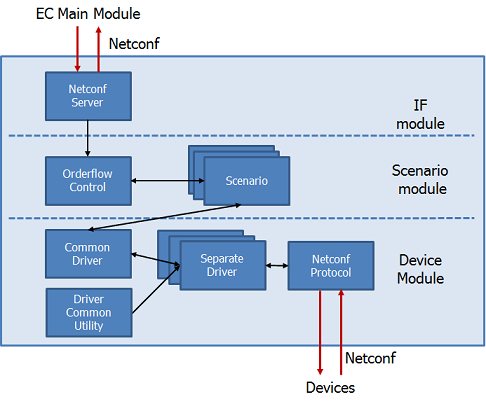

# Element Manager(EM)

Element Manager(EM) is one of the software components of Multi-Service Fabric(MSF).

 EM provides the function to convert abstracted instructions from upper systems (FC, EC) into vendor-specific configurations. Multiple device drivers for Southbound enable to extract suitable configurations. EM also has the function of order flow control that manages the configuration functions to multiple devices with one single transaction, and the roll-back functions in case of error by Netconf technology.

## System Elements

- Netconf Server:
  - Interface for EC main Module uses Netconf protocol
- OrderflowControl:
 - makes it possible to handle orders received from EC main module as one transaction. If any transaction fails, it rolls back the setting for each transaction.
 - selects the Scenario to be activated based on the contents of the order.
- Scenario
  - executes a scenario for controlling devices, corresponding the the content of the order.
- Common driver
  - stores the device information (device name, vendor type, management IP address, etc) in EM-Database when you add new switch.
  - specifies vendor type and which separate driver to access based on the information from Scenario.
  - stores all the information received from the EC.
- Driver Common Utility
  - provides interfaces for Separate Drivers to access EM-Database.
- Separate driver
  - provides interfaces for configuration setting to Scenario.
- Netconf Protocol
  - accesses each device with Netconf.

## How to use
- installation
  - [Simplified installation procedure with Ansible](doc/element_manager_automate_installation_manual.md)
  - [configuration specifications](doc/element_manager_configuration_specifications.md)
- build
  - [building manual](doc/element_manager_building_guide.md)

## Development
The following document describes the interface specifications and the points to be noted in order to newly develop a network driver for adding the switch that can be controlled by the EM.

- [API guide](doc/element_manager_api_specifications.md)

## Hardware
The following conditions are the minimum operation environment.

| item | Configuraiton |
| ---- | ---- |
| OS | CentOS 7.2 x86_64 |
| CPU | 2 Core or more |
| memory | 1G or more |
| NIC | 1 port or more |

## License
**Apache 2.0**. See `LICENSE`.

## support
If you have any questions, or find any bug, let us know with GitHub issues, or please contact `msf-contact [at] lab.ntt.co.jp`.

## project
This project is a part of [Multi-Service Fabric](http://github.com/multi-service-fabric/).
