## Element Manager API Specifications

**Version 1.0**
**March 28, 2018**
**Copyright(c) 2018 Nippon Telegraph and Telephone Corporation**

# 1. Introduction

1.1. Objective
---------

This document introduces the required interface specifications and the
points to be considered about the implementation when network equipment
vendors develop and embed network drivers to add new devices and control
them by use of the Element Manager (hereafter referred to as "EM").

1.2. Scope of Application
--------------------

The specifications are to be applied to the network drivers embedded to
EM as a driver individual part, which is one of the functional parts of
whole system.

1.3. Industrial Standards To Be Followed
-----------------------------------

Please refer to RFC 6241, 6242 for details about NETCONF protocol.

# 2. Overview

2.1. The Whole Picture of Implementation Consideration Points
--------------------------------------------------------

The target of implementation is Driver Individual Part. This part is
assumed to be created in units of equipment model and which one is
started for each running service is determined by a High Level
Functional Part.

Figure 2-1 below illustrates the points to be considered for the
implementation of Driver Individual Part. For more details about IFs and
information formats, see the cited sections in each consideration point.

Figure 2-1 The Whole Picture of Implementation Consideration Points

Consideration Point (1)

-   See Section 3.1 for the specifications that should be equipped in
    the driver individual part for the IF with High Level Functional
    Part and the data format of the information to be handed off.

-   See Section 3.1.1 for the detail of Service Type and Order Type.

Consideration Point (2)

-   See Section 3.3.2 for the detail of IF of Utility Functional Part
    (DB) and the response format of DB information.

Consideration Point (3)

-   See Section 3.2 for the detail of IF of Low Level Functional Part.

Consideration Point (4)

-   See the section of Device Control Signal Transmission of
    corresponding protocol in Section 3.2 for the overview of Device
    Control Information.

-   See Section 3.1 for the overview of Validation Check.

-   See Section 3.1.9 for the overview of Integrity Confirmation
    Process.

-   See each item of Section 3.1 for the mapping policy of response
    result.

Consideration Point (5)

-   See Section 3.4.2 for the detail of IF of Utility Functional Part
    (DB).

-   See Chapter 4 for the log format to be output.

See also Chapter 5 for the sequence related to Driver Individual Part.

# 3. IF Specifications

3.1. Driver Individual Part
----------------------

### 3.1.1. Overview

Preparing for the future addition of services and orders, it is stated
that all the IFs of Driver Individual Part commonly have their Device
Name, Service Type and Order Type as arguments regardless if they are
actually used or not.

For the IFs to which JSON data used in creating Device Control
Information, such as configurations, is handed down as an argument,
validation checks taking the equipment model into account must be
implemented (for implementation example, see Section 6.1). Although
there is possibility that you encounter IFs of which implementation of
internal process is not required depending on the model specifications
of devices to be controlled, it should be implemented so that the normal
responses are uniformly returned to the caller in those cases.

Except for the case of Device Configuration Integrity Control IF and
depending on the information received as an argument and necessity, it
creates device control information based on the DB Information
(Configured Device Information ) acquired through Utility Functional
Part (DB). Except for the case of Device Configuration Integrity Control
IF and depending on the information received as an argument and
necessity, it creates device control information based on the DB
Information (Configured Device Information ) acquired through Utility
Functional Part (DB). Then, it sends device control information as well
as instructs device access to the selected Low Level Functional Part
depending on the using protocol. Besides, it analyzes the response
result of the returned device and responds High Level Functional Part
with the execution result.

In Device Configuration Integrity Control IF, it collates the real time
device configuration information (Configuration Acquisition Information)
with the DB Information of EM and responds High Level Functional Part
with the result. See Section 3.1.9 for details.

See Chapter 5 "Sequence" about the relationship between the
instruction from High Level Functional Part and the instruction for Low
Level Functional Part of Driver Individual Part.

Table 3.1 depicts the relationship between the Service Type and Order
Type specified by High Level Functional Part and the other services.
"merge/delete/replace/get" operation is specified for the Order Type.

Table 3-1 Service List

  No.  | Service                                            |  Service Type |   Order Type
  -----|----------------------------------------------------|---------------|------------
  1    | Spine Extension                                    |  Spine        |   merge
  2    | Leaf Extension                                     |  leaf         |   merge
  3    | B-Leaf Generate                                    |  b-leaf       |   merge
  4    | B-Leaf Update                                      |  b-leaf       |   replace
  5    | B-Leaf Delete                                      |  b-leaf       |   delete
  6    | L2 Slice ENPN Control                              |  l2-slice     |   merge   delete
  7    | L3 Slice Add                                       |  l3-slice     |   merge
  8    | L3 Slice Delete                                    |  l3-slice     |   delete
  9    | L3 Slice Update                                    |  l3-slice     |   replace
  10   | LAG Addition for CE                                |  ce-lag       |   merge
  11   | LAG Deletion for CE                                |  ce-lag       |   delete
  12   | Internal Link IF Add                               |  internal-link|   merge
  13   | Internal Link IF Delete                            |  internal-link|   delete
  14   | EM Inter-Device Information Integration (L2 Slice) |  l2-slice     |   get
  15   | EM Inter-Device Information Integration (L3 Slice) |  l3-slice     |   get
  16   | Inter-Cluster Link Generate                        |  cluster-link |   merge
  17   | Inter-Cluster Link Delete                          |  cluster-link |   delete
  18   | breakoutIF Registration                            |  breakout     |   merge
  19   | breakoutIF Deletion                                |  breakout     |   delete  
  20   | Recovery Extension                                 |  recover-node |   merge
  21   | Service reconfiguration                            |  recover-service |   merge
  22   | L2 Slice Update                                    |  l2-slice     |   replace

In Figure 3-1, the part of which each service relates to the
configuration or others in an actual switch cluster NW construction is
mapped to device configuration examples.  

Figure 3-1 Relationship between Device NW Configuration Example and Each Service

### 3.1.2. Device Connection Control

Figure 3-2 IF Detail of Device Connection Control

Device information is required as an argument to run the Low Level
Functional Part. Figure 3-3 illustrates the format of device
information. No. 9 and 10 are specified by Driver Individual Part when
using the Low Level Functional Part for NETCONF (They are not necessary
when using the Low Level Functional Part for CLI). Device Information
(Device Handler) is specified only when it is required by the
specifications of NETCONF Client Library (ncclient) used by the
Functional Part. See the document of the library for more details
(Reference URL: https://pypi.python.org/pypi/ncclient). Port Number is
specified only if you want to change the port to use in NETCONF
communication from well-known port.

Figure 3-3 Format of Device Information

### 3.1.3. Device Configuration Update Control

Only the services of which Order Type is "merge" or "replace" are
specified by High Level Functional Part. Specifically, the services of
No. 1-4, 6, 7, 9, 10, 12, 16, 18, 20, 21 and 22 in Table 3-1 Service List
(combinations of Service Type and Order Type) are specified. Figure 3-4
IF Detail of Device Configuration Update Control depicts the detailed
information of interfaces which are instructed from High Level
Functional Part to Driver Individual Part. And Figure 3-5 through Figure
3-15 depict the format of configuration value of Argument 4 which is
input information of each service.

It performs Device Control Signal Transmission of Low Level Functional
Part. At that time, it analyzes the response result from the device of
returned value, and responds High Level Functional Part with "1: Update
Normal" when the result does not contain error message, or responds
with "3: Update Error" when the result contains error message or the
response was "False".

Also, while generating device control information, it does validation
check of configuration value of Argument 4 which becomes input
information, and responds with "2: Validation Check NG" when there is
any problem. See Section 6.1 for the overview of Validation Check.

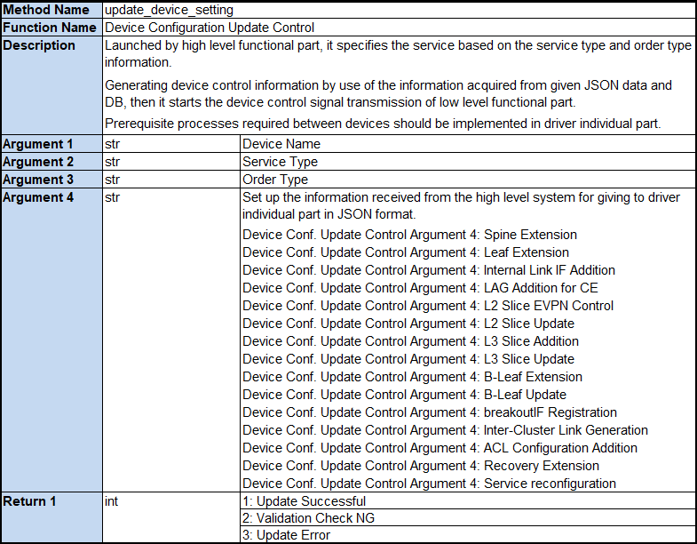

Figure 3-4 IF Detail of Device Configuration Update Control

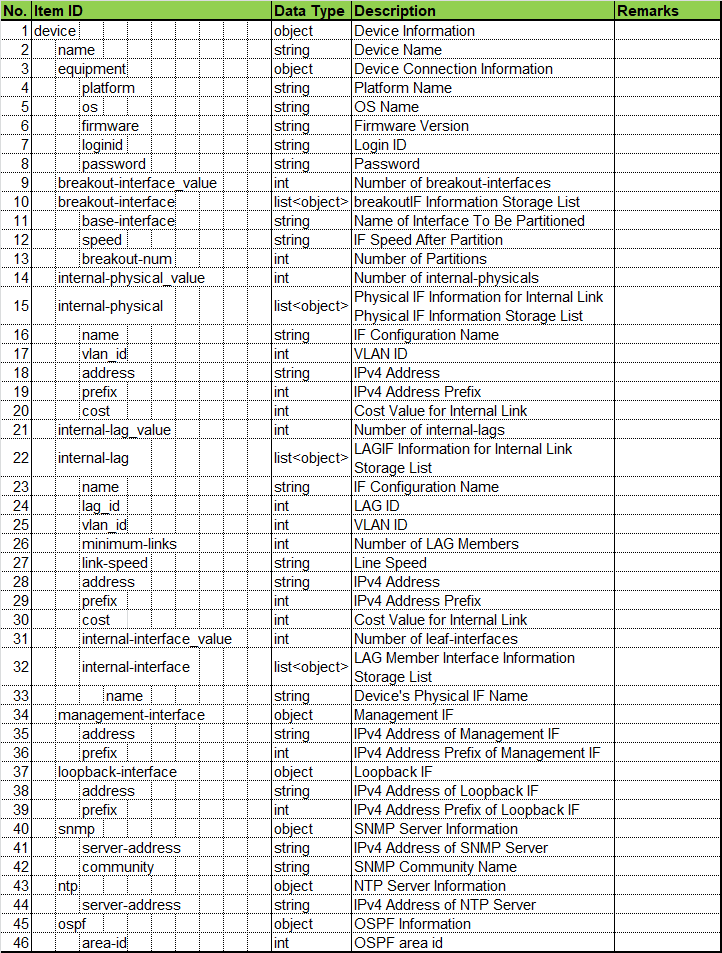

Figure 3-5 Format of Spine Extension Information

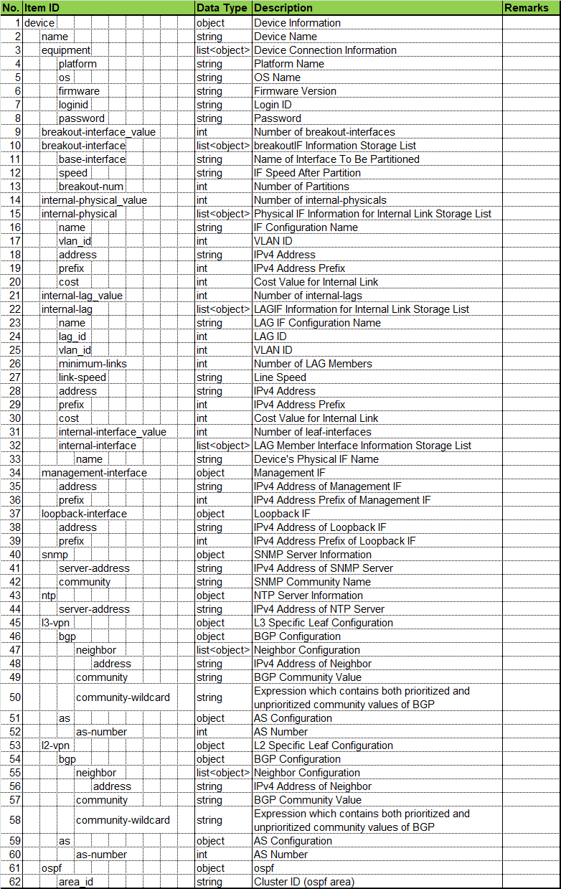

Figure 3-6 Format of Leaf Extension Information

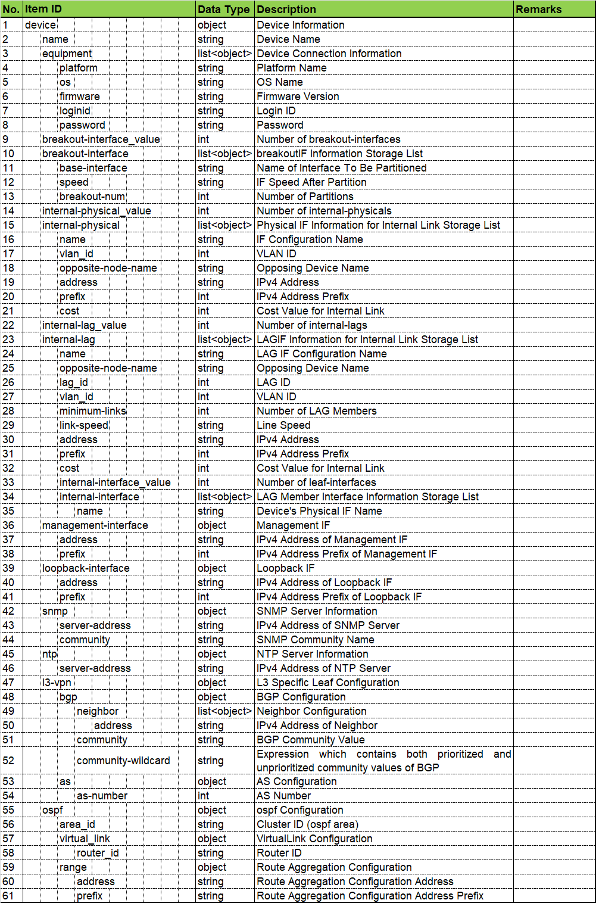

Figure 3-7 Format of B-Leaf Generation Information

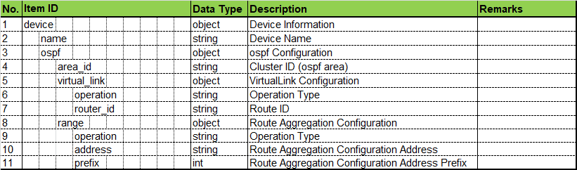

Figure 3-8 Format of B-Leaf Update Information

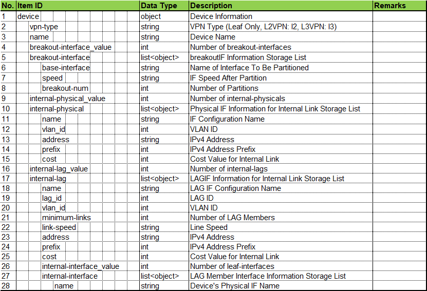

Figure 3-9 Format of Internal Link IF Addition Information

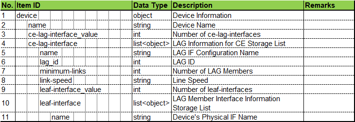

Figure 3-10 Format of LAG Addition for CE Information

Figure 3-11 Format of L2 Slice EVPN Control Information

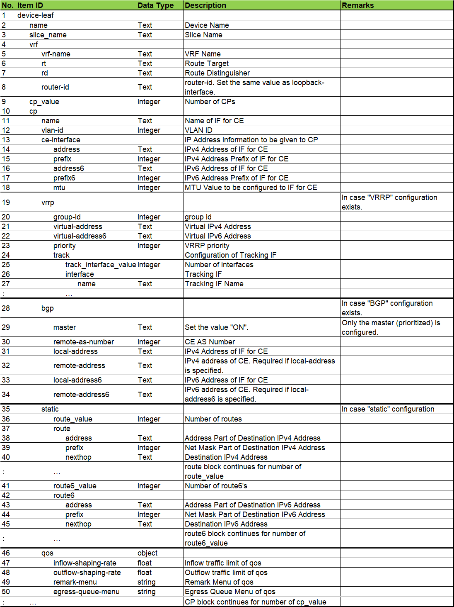

Figure 3-12 Format of L3 Slice Addition Information

Figure 3-13 Format of L3 Slice Update Information

Figure 3-14 Format of breakoutIF Registration Information

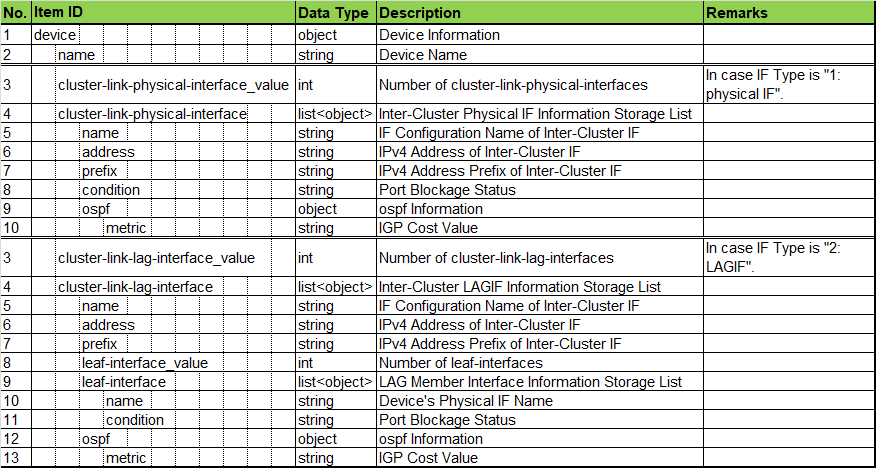

Figure 3-15 Format of Inter-Cluster Link Generation Information

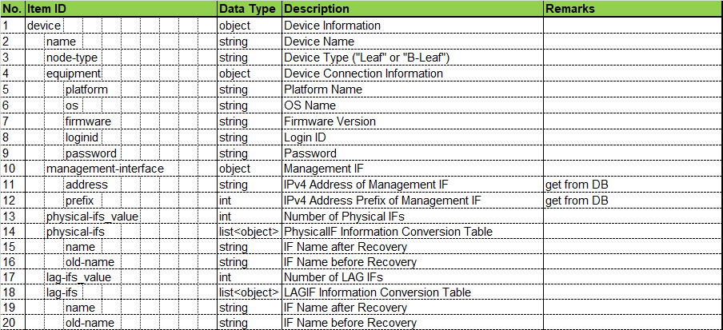

Figure 3-16 Format of Recovery Extension Information

Figure 3-17 Format of Service Reconfiguration Information

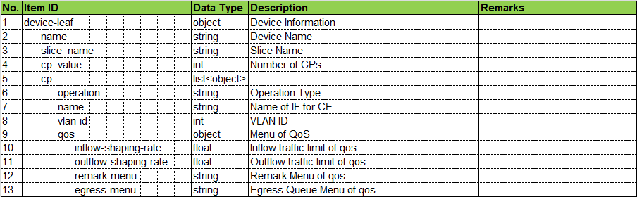

Figure 3-18 Format of L2 Slice Update Information

### 3.1.4. Device Configuration Deletion Control

Only the services of which Order Type is "delete" are specified by
High Level Functional Part. Specifically, the services of No. 5, 8, 11,
13, 17 and 19 in Table 3-1 Service List (combinations of Service Type
and Order Type) are specified. Figure 3-19 IF Detail of Device
Configuration Deletion Control depicts the detailed information of
interfaces which are instructed from High Level Functional Part to
Driver Individual Part. And Figure 3-20 through Figure 3-25 depict the
format of configuration value of Argument 4 which is input information
of each service. Same as Device Configuration Update Control, it
responds High Level Functional Part with corresponding result depending
on the returned value of performing Device Control Signal Transmission
of Low Level Functional Part. See Section 3.1.3 for the mapping policy.

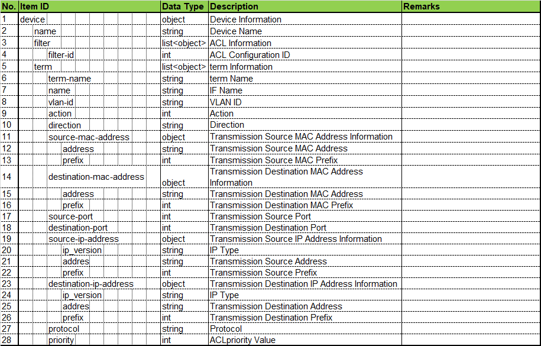

Figure 3-19 IF Detail of Device Configuration Deletion Control

Figure 3-20 Format of B-Leaf Deletion Information

Figure 3-21 Format of Internal Link IF Deletion Information

Figure 3-22 Format of LAG Deletion for CE Information

Figure 3-23 Format of L3 Slice Deletion Information

Figure 3-24 Format of breakoutIF Deletion Information

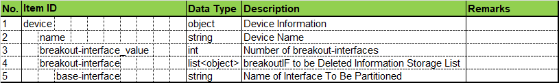

Figure 3-25 Format of Inter-Cluster Link Deletion Information

### 3.1.5. Device Configuration Reservation Control

It performs Device Control Signal Transmission of Low Level Functional
Part. At that time, it analyzes the response result from the device of
returned value, and responds High Level Functional Part with "True:
Normal" when the result does not contain error message, or responds
with "False: Error" when the result contains error message or the
response was "False".

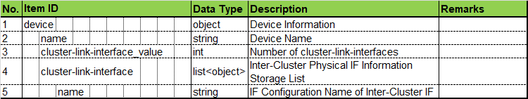

Figure 3-26 IF Detail of Device Configuration Reservation Control

### 3.1.6. Device Configuration Enablement Control

Same as Device Configuration Reservation Control, it responds High Level
Functional Part with corresponding result depending on the returned
value of performing Device Control Signal Transmission of Low Level
Functional Part. See Section 3.1.5 for the mapping policy.

Figure 3-27 IF Detail of Device Configuration Enablement Control

### 3.1.7. Device Disconnection Control

Taking over the return value of performing Device Control Signal
Transmission of Low Level Functional Part, it responds High Level
Functional Part with "True: Normal" or "False: Error".

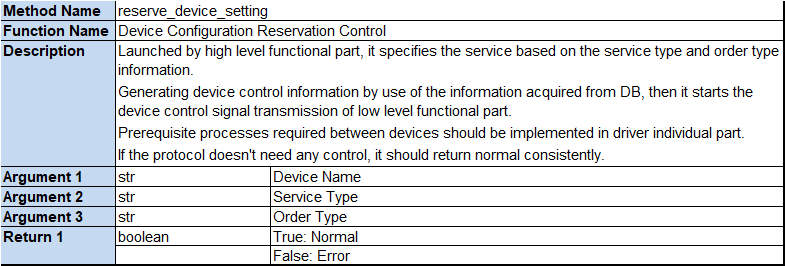

Figure 3-28 IF Detail of Device Disconnection Control

### 3.1.8. Device Configuration Acquisition Control

Only the services of which Order Type is "get" are specified by High
Level Functional Part. Specifically, the services of No. 11 and 12 in
Table 3-1 Service List (combinations of Service Type and Order Type) are
specified. Same as Device Configuration Reservation Control, it responds
High Level Functional Part with corresponding result depending on the
returned value of performing Device Control Signal Transmission of Low
Level Functional Part. See Section 3.1.5 for the mapping policy.

The character string of response result (Configuration) from the device
of Return 2 is specified by High Level Functional Part as an argument of
Device Configuration Integrity Control IF via the following sequence.

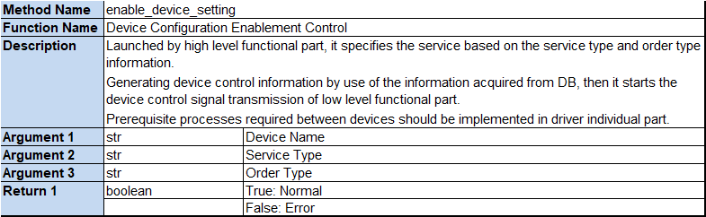

Figure 3-29 IF Detail of Device Configuration Acquisition Control

### 3.1.9. Device Configuration Integrity Control

The services of No. 11 and 12 in Table 3-1 Service List (combinations of
Service Type and Order Type) are specified by High Level Functional
Part.

It is performed by High Level Functional Part in order to confirm if the
information of which EM retains in DB is identical with the actual
device configuration information. The target of information integration
is L2 and L3 slice related information. It collates the result of device
configuration acquisition at Device Configuration Acquisition Control
with DB information (see Figure 3-42 and Figure 3-43) acquired through
Utility Common Part (DB) and if they are identical, returns "True:
Normal" or otherwise, returns "False: Error".

Figure 3-30 IF Detail of Device Configuration Integrity Control

3.2. Driver Individual Part Low Level Functional Part
------------------------------------------------

### 3.2.1. Overview

Each protocol has its distinct class and it carries out the transmit and
receive of signal for connection/disconnection and control of devices.
In Driver Individual Part, it generates an instance of corresponding
class for the using protocol at the time of initialization or others,
and it implements appropriate calling processes in accordance with the
instruction of IFs described in the following sections for each
protocol.

See Chapter 5 "Sequence" for the relationship between instruction from
Driver Individual Part and Device Control.

### 3.2.2. IF for NETCONF Protocol

The signal transmit and receive control for devices is materialized by
use of NETCONF Client Library (ncclient).

#### 3.2.2.1. Device Connection Control

See Figure 3-3 Format of Device Information for more details about
Device Information.

Figure 3-31 IF Detail of Device Connection Control (Low Level Functional Part, Netconf)

#### 3.2.2.2. Device Control Signal Transmission

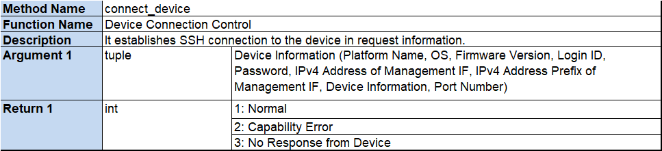

Figure 3-32 IF Detail of Device Control Signal Transmission (Netconf)

When executing this IF from Driver Individual Part, specify NETCONF
Message Type and Device Control Information (XML Message) as arguments.
Figure 3-33 and Figure 3-34 illustrate the task sharing between Driver
Individual Part and Low Level Functional Part for creating each of
edit-config and get-config NETCONF message. The lines with blue letters
indicate the part which is made up by Driver Individual Part (device
specific part for each vendor) and the remaining NETCONF protocol common
parts are given by Low Level Functional Part.

In case of the other message types, messages are generated only by Low
Level Functional Part so set None (no specification) for Argument 2.

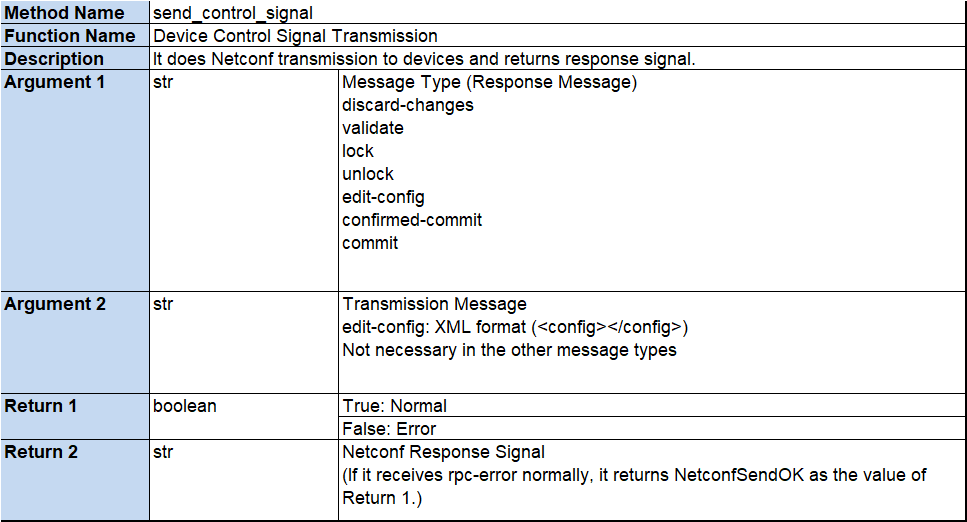

Figure 3-33 Image of Sharing Netconf Message
Creation between Driver Individual Part and Low Level Functional Part
(edit-config)

Figure 3-34 Image of Sharing Netconf Message
Creation between Driver Individual Part and Low Level Functional Part
(get-config)

#### 3.2.2.3. Device Disconnection Control

Figure 3-35 IF Detail of Device Disconnection Control (Low Level Functional Part, Netconf)

### 3.2.3. IF for CLI Protocol

The signal transmit and receive control for devices is materialized by
use of ssh connection.

#### 3.2.3.1. Device Connection Control

See Figure 3-3 Format of Device Information for more details about
Device Information.

Figure 3-36 IF Detail of Device Connection Control (Low Level Functional Part, CLI)

#### 3.2.3.2. Device Control Signal Transmission

Figure 3-37 IF Detail of Device Control Signal Transmission (CLI)

When executing this IF from Driver Individual Part, specify Message Type
and the CLI Command executing at device side as arguments. However, in
the current version, the Message Type is fixed to edit-config in the
case of using CLI protocol.

#### 3.2.3.3. Device Disconnection Control

Figure 3-38 IF Detail of Device Disconnection Control (Low Level Functional Part, CLI)

3.3. Utility Functional Part (DB)
----------------------------

### 3.3.1. Overview

In accordance with the Service Type specified by Driver Individual Part,
it gets all the information relating to the corresponding service from
DB.

### 3.3.2. Read Configured Information

Figure 3-39 IF Detail of Read Configured Information

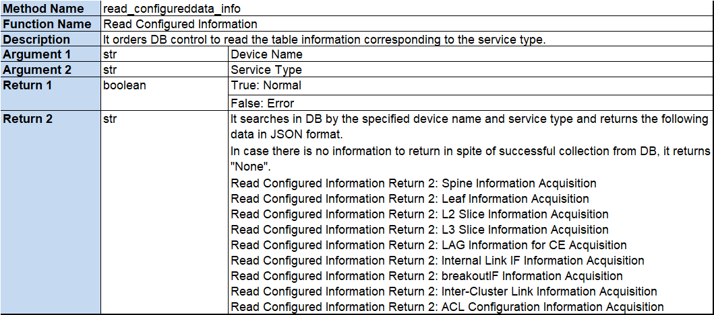

Figure 3-40 Format of Spine Information Acquisition

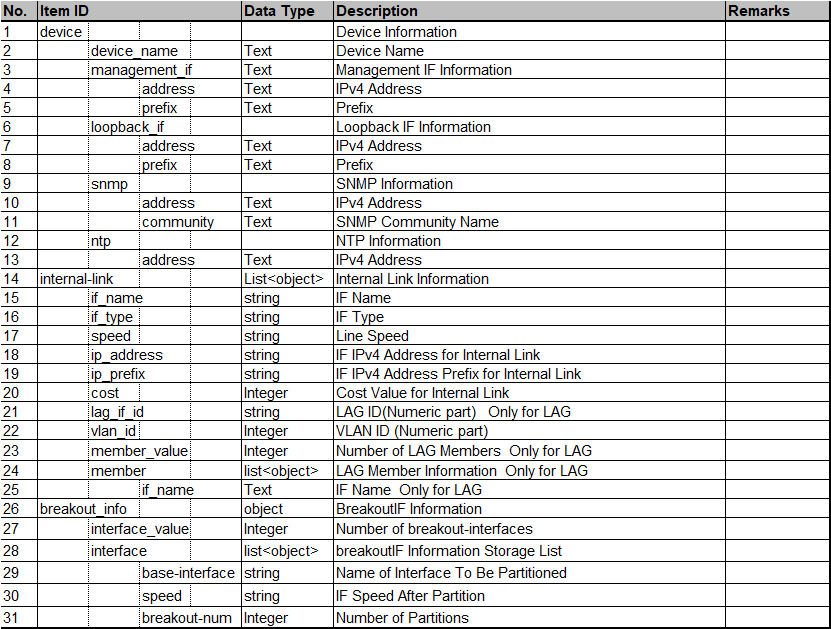

Figure 3-41 Format of Leaf Information Acquisition

Figure 3-42 Format of L2 Slice Information Acquisition

Figure 3-43 Format of L3 Slice Information Acquisition

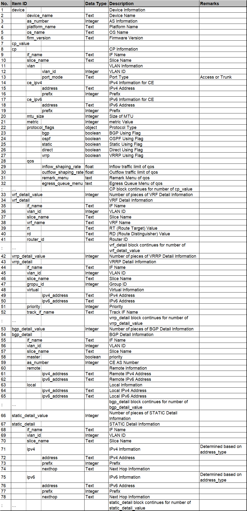

Figure 3-44 Format of LAG for CE Information Acquisition

Figure 3-45 Format of Internal Link IF Information Acquisition

Figure 3-46 Format of breakoutIF Information Acquisition

Figure 3-47 Format of Inter-Cluster Link Information Acquisition

### 3.3.3. Acquiring Device Type and VPN Type

Figure 3-48 IF Detail of Acquiring Device Type and VPN Type

3.4. Utility Functional Part (LOG)
-----------------------------

### 3.4.1. Overview

It provides log output processes to Driver Individual Part based on the
standard Logging function of Python. According to the Device Name, Log
Level and messages specified by Driver Individual Part, it outputs log
to the specified location in EM\'s regular format. See Chapter 4 for
details about the contents of output and the format.

The destination of log output is defined in EM\'s system configuration
file (conf\_sys\_common.conf); In standard configuration,
"../logs/em/log/application.log" is set as the relative path of
directory in EM. The logging level of output ("INFO" in the standard
configuration) is also defined in the system configuration file. Please
confirm to your system administrator for more detailed information about
the storage location of each file.

### 3.4.2. Log Output for Driver Individual Part

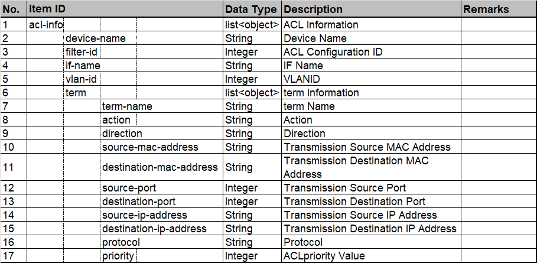

Figure 3-49 IF Detail of Log Output for Driver Individual Part

# 4. Log

4.1. Contents of Output and Format
-----------------------------

Table 4-1 shows the items displayed in log. And Figure 4-1 depicts the
output image for each item.

Table 4-1 Items of Display

  No.  | Item Name
  -----|--------------------------------------------------
  1    | Date and Time
  2    | Level (DEBUG/INFO/WARN/ERROR)
  3    | Thread ID \* Given by High Level Functional Part
  4    | Class Name
  5    | Method Name
  6    | Line Number in Source File
  7    | Message \* half-width alpha numeric

Figure 4-1 Output Image

# 5. Sequence

5.1. For NETCONF Protocol
--------------------

### 5.1.1. Configuration Set/Delete Sequence

It implements NETCONF protocol conscious sequences. Especially, Lock
process of executed configuration should be implemented taking the
security in the situation in which several requests to a single device
occur simultaneously into consideration.

Figure 5-1 Example of Configuration Set/Delete Sequence

### 5.1.2. Information Integrity Sequence

In accordance with the instruction given from higher level, this
sequence acquires the real time configuration from the device and
collates it with the DB storage information to verify if there is any
difference between them. The Device Configuration is acquired with
get-config of NETCONF protocol.

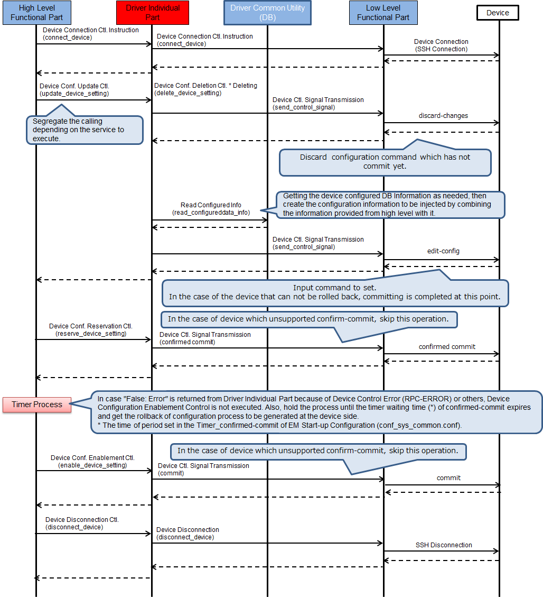

Figure 5-2 Information Integrity Sequence

5.2. For CLI Protocol
----------------

### 5.2.1. Configuration Set/Delete Sequence

It implements CLI protocol conscious sequences. Unlike in NETCONF
protocol, the injection of device configuration and its commitment are
processed at the same time in CLI protocol, so it cannot roll back the
device configuration automatically when configuration setting failed.

Figure 5-3 Example of Configuration Set/Delete Sequence

# 6. Other Implementation Guideline

6.1. Validation Check Overview
-------------------------

Since High Level Functional Part doesn\'t retain the information
regarding to equipment model specifications of the device to be
controlled, it specifies the information received from higher level
system to Driver Individual Part IF without checking the feasibility of
configuration. So, in Driver Individual Part, it must verify this
information when generating device control information with taking the
model specifications into account. Table 6-1 indicates the checking
policy.

Table 6-1 Checking Policy

  No.  | Request Check
  -----|----------------------------------------------------------------------------------------------------------
  1    | For the request from higher level, check if there is unconfigurable content on the specification or not.
  2    | Perform when converting the request from higher level into the format of device control information.
  3    | If there is any unconfigurable content to the device, say it NG and return "2: Validation Check NG".

Table 6-2 shows the check contents for Cisco devices implemented in
Driver Individual Part as an example of Validation Check.

Table 6-2 Check Example (for Cisco devices)

  No.  | Service To Be Checked  | Check Description
  -----|------------------------|--------------------------------------------------------------
  1    | L3 Slice Addition      | To make sure that IPv6 related configuration does not exist.
  2    | L3 Slice Deletion      | Ditto.

6.2. Consideration Points on Process Performance
-------------------------------------------

EM states its performance goal as "the time interval between receiving
transmission from higher level system and sending the first instruction
must be equal to or less than one second." In order to achieve this
goal, you should avoid implementing unnecessary processes in Driver
Individual Part and try to shorten the processing time.

The interval to be measured in the sequence of Driver Individual Part is
the period between High Level Functional Part issues Device Connection
Control Instruction and Low Level Functional Part performs it.
Considering the actual performance of Driver Individual Part ever
measured, the range of a few milliseconds is the guideline of processing
time.

6.3. Reference Information
---------------------

### 6.3.1. NETCONF Capability

Table 6-3 shows the NETCONF Capability of which Low Level Functional
Part for NETCONF is sending to devices with Hello.

Table 6-3 NETCONF Capability List (between Low
Level Functional Part and a Device)

  No  | NETCONF Capability
  ----|----------------------------------------------------------------------------
  1   | urn:ietf:params:netconf:base:1.0
  2   | urn:ietf:params:netconf:base:1.1
  3   | urn:ietf:params:netconf:capability:writable-running:1.0
  4   | urn:ietf:params:netconf:capability:rollback-on-error:1.0
  5   | urn:liberouter:params:netconf:capability:power-control:1.0
  6   | urn:ietf:params:netconf:capability:validate:1.0
  7   | urn:ietf:params:netconf:capability:confirmed-commit:1.0
  8   | urn:ietf:params:netconf:capability:url:1.0?scheme=http,ftp,file,https,sftp
  9   | urn:ietf:params:netconf:capability:candidate:1.0
  10  | urn:ietf:params:netconf:capability:xpath:1.0
  11  | urn:ietf:params:netconf:capability:startup:1.0
  12  | urn:ietf:params:netconf:capability:interleave:1.0
