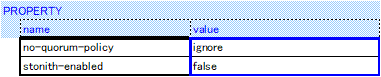
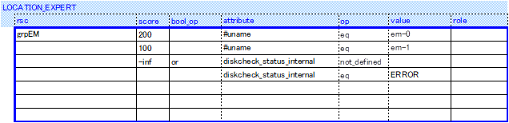

# Element Manager Automate Installation Manual

**Version 1.0**
**December 7, 2018**
**Copyright(c) 2018 Nippon Telegraph and Telephone Corporation**

## 1. Introduction

1.1. Objective
---------

This document is the installation manual for the EM Module included in
the Element Manager (hereafter referred to as \"EM\").
Please read this manual carefully before using the software.

1.2. Scope of Application
--------------------

The scope of this document is for the operation of the components of EM
Module of Controller.

The subjects other than that are not covered in this document.

1.3. Expressional Conventions
------------------------

There are certain expressions and text styles conventionally used in
this document. Please make yourself clear about the items below before
going on through the document.

**\[XX XX\]** - bold letters surrounded by square brackets

This means the command to be entered in Linux.

**X \[Enter\]** - bold letter and \"\[Enter\]\"

> In this case, you need to enter the letters within brackets and press
> the Enter key in the console screen.

1.4. Trademark Notice
----------------

All company names and product names mentioned in this document are
registered trademarks or trademarks of their respective companies.

**LinuxR**

The registered trademark or the trademark of Linus Torvalds in the U.S.
and other countries

**PostgreSQLR**

The trademark of PostgreSQL in the U.S. and other countries

1.5. Configuration of the Included Accessories
-----------------------------------------

The \"Table-1-1 Included Accessories\" below illustrates the required
items to follow the installation instructions in this document.

For the items described as \"in-advance DL\", you must download and
prepare them prior to implementing the installation in this document
at no internet connection.
Then, place the acquired files under the em folder of the target server (created in Chapter 3)
so that they are the same as the following file structure.

Table 1-1 Included Accessories

| \#      | Folder Structure  | |       |         | File Name    | Descriprion | Remarks |
|---------|---------|---------|---------|---------|---------|---------|---------|
| 1.      | em      | \-      | \-      | \-      | \-      | \-      | \-      |
| 2.      |         |         |         |         | whl_package.tar | In-use Python Library Package  | In-Advance DL from GitHub  |
| 3.      |         |         |         |         | paramiko-2.0.2-py2.py3-none-any.whl | In-use Python Library Package  | In-Advance DL |
| 4.      |         |         |         |         | psycopg2-2.6.2-cp27-cp27mu-linux_x86_64.whl | In-use Python Library Package  | In-Advance DL |
| 5.      |         |         |         |         | pip-8.1.2.tar.gz | PIP Command for Python Library Install     | In-Advance DL |
| 6.      |         |         |         |         | setuptools-28.6.0.tar.gz | pip Dependent Package     | In-Advance DL |
| 7.      |         | bin     |         |         | em      | Resource Agent | In-Advance DL from GitHub  |
| 8.      |         |         |         |         | em_ctl.sh | EM Start-up Script      | In-Advance DL from GitHub  |
| 9.      |         |         |         |         | EmMonitor.py | Alive Monitor Client   | In-Advance DL from GitHub  |
| 10.      |         |         |         |         | controller_status.sh | Controller Status Information  Acquisition Script | In-Advance DL from GitHub  |
| 11.      |         | lib     |         |         | MsfEmMain.py | Main Module    | In-Advance DL from GitHub  |
| 12.      |         |         |         |         | GlobalModule.py | Global Module  | In-Advance DL from GitHub  |
| 13.      |         |         |         |         | EmCommonLog.py | EM Common Log Module      | In-Advance DL from GitHub  |
| 14.      |         |         |         |         | EmSetPATH.py | PYTHONPATH Configuration Module for EM | In-Advance DL from GitHub  |
| 15.      |         |         |         |         | EmLoggingFormatter.py | Log Formater Module for EM     | In-Advance DL from GitHub  |
| 16.      |         |         |         |         | \__init__.py | Initialization Module | In-Advance DL from GitHub  |
| 17.      |         |         | CommonDriver |    | EmCommonDriver.py | Driver Common Part Module  | In-Advance DL from GitHub  |
| 18.      |         |         |         |         | \__init__.py | Initialization Module | In-Advance DL from GitHub  |
| 19.      |         |         | Config  |         | EmConfigManagement.py | Configuration Management Module | In-Advance DL from GitHub  |
| 20.      |         |         |         |         | \__init__.py | Initialization Module | In-Advance DL from GitHub  |
| 21.      |         |         | DB      |         | EmDBControl.py | DB Control Module      | In-Advance DL from GitHub  |
| 22.      |         |         |         |         | \__init__.py | Initialization Module | In-Advance DL from GitHub  |
| 23.      |         |         | DriverUtility |   | EmDriverCommonUtilityDB.py | Driver Common Utility (DB) Module  | In-Advance DL from GitHub  |
| 24.      |         |         |         |         | EmDriverCommonUtilityLog.py | Driver Common Utility (Log) Module  | In-Advance DL from GitHub  |
| 25.      |         |         |         |         | \__init__.py | Initialization Module | In-Advance DL from GitHub  |
| 26.      |         |         | Netconf Serve |   | EmNetconfServer.py | EM Netconf Server Module      | In-Advance DL from GitHub  |
| 27.      |         |         |         |         | \__init__.py | Initialization Module | In-Advance DL from GitHub  |
| 28.      |         |         | OrderflowControl |         | EmOrderflowControl.py | Order Flow Control Module   | In-Advance DL from GitHub  |
| 29.      |         |         |         |         | \__init__.py | Initialization Module | In-Advance DL from GitHub  |
| 30.      |         |         | Protocol |        | EmNetconfProtocol.py | For-device Protocol Process Module | In-Advance DL from GitHub  |
| 31.      |         |         |         |         | EmCLIProtocol.py | Protocol Processing (CLI) Module for Devices | In-Advance DL from GitHub  |
| 32.      |         |         |         |         | EmNetconfClient.py | Ncclient Original implementation processing module | In-Advance DL from GitHub  |
| 33.      |         |         |         |         | CumulusCLIProtocol.py | Protocol Processing (CLI) Module for Devices (Cumulus) | In-Advance DL from GitHub  |
| 34.      |         |         |         |         | EmCLIProtocolBase.py | Protocol Processing (CLI) Module for Devices (Bse) | In-Advance DL from GitHub  |
| 35.      |         |         |         |         | \__init__.py | Initialization Module | In-Advance DL from GitHub  |
| 36.      |         |         | RestScenario |    | EmControllerLogGet.py | Controller Log Acquisition Scenario | In-Advance DL from GitHub  |
| 37.      |         |         |         |         | EmControllerStatusGet.py | Controller Status Acquisition Scenario | In-Advance DL from GitHub  |
| 38.      |         |         |         |         | EmSeparateRestScenario.py | REST Individual Scenario Module    | In-Advance DL from GitHub  |
| 39.      |         |         |         |         | \__init__.py | Initialization Module | In-Advance DL from GitHub  |
| 40.      |         |         | RestServer |      | EmRestServer.py | REST Server Module    | In-Advance DL from GitHub  |
| 41.      |         |         |         |         | \__init__.py | Initialization Module | In-Advance DL from GitHub  |
| 42.      |         |         | Scenario |        | EmACLFilterDelete.py | ACL Filter Deletion Scenario  | In-Advance DL from GitHub  |
| 43.      |         |         |         |         | EmACLFilterMerge.py | ACL Filter Generation Scenario  | In-Advance DL from GitHub  |
| 44.      |         |         |         |         | EmBLeafDelete.py | B-Leaf Deletion Scenario  | In-Advance DL from GitHub  |
| 45.      |         |         |         |         | EmBLeafMerge.py | B-Leaf Generation Scenario  | In-Advance DL from GitHub  |
| 46.      |         |         |         |         | EmBLeafScenario.py | B-Leaf Scenario Modulef  | In-Advance DL from GitHub  |
| 47.      |         |         |         |         | EmBLeafUpdate.py | B-Leaf Update Scenario  | In-Advance DL from GitHub  |
| 48.      |         |         |         |         | EmBreakoutIFDelete.py | BreakoutIF Deletion Scenario | In-Advance DL from GitHub  |
| 49.      |         |         |         |         | EmBreakoutIFMerge.py | BreakoutIF Registration Scenario | In-Advance DL from GitHub  |
| 50.      |         |         |         |         | EmCeLagDelete.py | LAG Deletion Scenario for CE     | In-Advance DL from GitHub  |
| 51.      |         |         |         |         | EmCeLagMerge.py | LAG Addition Scenario for CE     | In-Advance DL from GitHub  |
| 52.      |         |         |         |         | EmClusterLinkDelete.py | Inter-Claster Link I/F Deletion Scenario | In-Advance DL from GitHub  |
| 53.      |         |         |         |         | EmClusterLinkMerge.py | Inter-Claster Link I/F Addition Scenario | In-Advance DL from GitHub  |
| 54.      |         |         |         |         | EmDeleteScenario.py | Resource Deletion Scenario Module | In-Advance DL from GitHub  |
| 55.      |         |         |         |         | EmInternalLinkDelete.py | Internal Link Delete Scenario | In-Advance DL from GitHub  |
| 56.      |         |         |         |         | EmInternalLinkMerge.py | Internal Link Merge Scenario | In-Advance DL from GitHub  |
| 57.      |         |         |         |         | EmL2SliceEvpnControl.py | L2 Slice EVPN Control Scenario | In-Advance DL from GitHub  |
| 58.      |         |         |         |         | EmL2SliceDelete.py | L2 Slice Deletion Scenario      | In-Advance DL from GitHub  |
| 59.      |         |         |         |         | EmL2SliceGet.py | L2 Slice Information Adjustment Scenario      | In-Advance DL from GitHub  |
| 60.      |         |         |         |         | EmL2SliceMerge.py | L2 Slice Addition Scenario      | In-Advance DL from GitHub  |
| 61.      |         |         |         |         | EmL2SliceUpdate.py | L2 Slice Update Scenario      | In-Advance DL from GitHub  |
| 62.      |         |         |         |         | EmL3SliceDelete.py | L3 Slice Deletion Scenario      | In-Advance DL from GitHub  |
| 63.      |         |         |         |         | EmL3SliceGet.py | L3 Slice Information Adjustment Scenario      | In-Advance DL from GitHub  |
| 64.      |         |         |         |         | EmL3SliceMerge.py | L3 Slice Addition Scenario      | In-Advance DL from GitHub  |
| 65.      |         |         |         |         | EmL3SliceUpdate.py | L3 Slice Update Scenario      | In-Advance DL from GitHub  |
| 66.      |         |         |         |         | EmLeafDelete.py | Leaf Deletion Scenario    | In-Advance DL from GitHub  |
| 67.      |         |         |         |         | EmLeafMerge.py | Leaf Addition Scenario    | In-Advance DL from GitHub  |
| 68.      |         |         |         |         | EmMergeScenario.py | Resource Addition Scenario Module | In-Advance DL from GitHub  |
| 69.      |         |         |         |         | EmRecover.py | Recover Node Scenario | In-Advance DL from GitHub  |
| 70.      |         |         |         |         | EmRecoverNode.py | Recover Node Scenario | In-Advance DL from GitHub  |
| 71.      |         |         |         |         | EmRecoverService.py | Recover Node Scenario | In-Advance DL from GitHub  |
| 72.      |         |         |         |         | EmSpineDelete.py | Spine Deletion Scenario   | In-Advance DL from GitHub  |
| 73.      |         |         |         |         | EmSpineMerge.py | Spine Addition Scenario   | In-Advance DL from GitHub  |
| 74.      |         |         |         |         | EmSeparateScenario.py | Individual Scenario Module | In-Advance DL from GitHub  |
| 75.      |         |         |         |         | \__init__.py | Initialization Module | In-Advance DL from GitHub  |
| 76.      |         |         | SeparateDriver |  | BeluganosDriver.py | Beluganos Driver Module       | In-Advance DL from GitHub  |
| 77.      |         |         |         |         | CiscoDriver.py | Cisco (5001, 5011) Driver Module       | In-Advance DL from GitHub  |
| 78.      |         |         |         |         | CiscoDriver5501.py | Cisco 5501 Driver Module       | In-Advance DL from GitHub  |
| 79.      |         |         |         |         | CLIDriver.py | CLI Driver Module       | In-Advance DL from GitHub  |
| 80.      |         |         |         |         | CumulusDriver.py | Cumulus Driver Module       | In-Advance DL from GitHub  |
| 81.      |         |         |         |         | JuniperDriver5100.py | Juniper 5100 Driver Module       | In-Advance DL from GitHub  |
| 82.      |         |         |         |         | JuniperDriver5110.py | Juniper 5110 Driver Module       | In-Advance DL from GitHub  |
| 83.      |         |         |         |         | JuniperDriver5200.py | Juniper 5200 Driver Module       | In-Advance DL from GitHub  |
| 84.      |         |         |         |         | JuniperDriverMX240.py | J Company Core Router Driver Module       | In-Advance DL from GitHub  |
| 85.      |         |         |         |         | OcNOSDriver.py | OcNOS Driver Module   | In-Advance DL from GitHub  |
| 86.      |         |         |         |         | EmSeparateDriver.py | Driver Individual Module  | In-Advance DL from GitHub  |
| 87.      |         |         |         |         | \__init__.py | Initialization Module | In-Advance DL from GitHub  |
| 88.      |         |         |         | RecoverUtility | EmRecoverUtilBase.py | Recover Node Utility Module (base)  | In-Advance DL from GitHub  |
| 89.      |         |         |         |         | EmRecoverUtilACL.py | Recover Node Utility Module (ACL Filter)  | In-Advance DL from GitHub  |
| 90.      |         |         |         |         | EmRecoverUtilBLeaf.py | Recover Node Utility Module (B-Leaf)  | In-Advance DL from GitHub  |
| 91.      |         |         |         |         | EmRecoverUtilCeLag.py | Recover Node Utility Module (CE LAG)  | In-Advance DL from GitHub  |
| 92.      |         |         |         |         | EmRecoverUtilClusterLink.py | Recover Node Utility Module (Inter-Claster Link)  | In-Advance DL from GitHub  |
| 93.      |         |         |         |         | EmRecoverUtilL2Slice.py | Recover Node Utility Module (L2 Slice)  | In-Advance DL from GitHub  |
| 94.      |         |         |         |         | EmRecoverUtilL3Slice.py | Recover Node Utility Module (L3 Slice)  | In-Advance DL from GitHub  |
| 95.      |         |         |         |         | EmRecoverUtilLeaf.py | Recover Node Utility Module (Leaf)  | In-Advance DL from GitHub  |
| 96.      |         |         |         |         | \__init__.py | Initialization Module | In-Advance DL from GitHub  |
| 97.      |         |         | SystemUtility |   | EmSysCommonUtilityDB.py | System Common (DB) Utility Module  | In-Advance DL from GitHub  |
| 98.      |         |         |         |         | \__init__.py | Initialization Module | In-Advance DL from GitHub  |
| 99.      |         | conf    |         |         | conf_driver.conf | Driver Individual Part Operational Configuration File  | In-Advance DL from GitHub  |
| 100.      |         |         |         |         | conf_if_process.conf | I/F Process Part Operational Configuration File     | In-Advance DL from GitHub  |
| 101.      |         |         |         |         | conf_scenario.conf | Scenario Individual Part Operational Configuration File | In-Advance DL from GitHub  |
| 102.      |         |         |         |         | conf_sys_common.conf | EM Common Configuration File      | In-Advance DL from GitHub  |
| 103.      |         |         |         |         | conf_separate_driver_cisco.conf | Cisco Driver Operation Configuration File       | In-Advance DL from GitHub  |
| 104.      |         |         |         |         | conf_if_process_rest.conf | REST Server Operation Configuration FileT    | In-Advance DL from GitHub  |
| 105.      |         |         |         |         | conf_scenario_rest.conf | REST Scenario Individual Part Operation Configuration File    | In-Advance DL from GitHub  |
| 106.      |         |         |         |         | conf_service.conf | Service Definition Configuration FileT    | In-Advance DL from GitHub  |
| 107.      |         |         |         |         | conf_internal_link_vlan.conf | OS (Requires VLAN ID on internal link) specification Configuration File    | In-Advance DL from GitHub  |
| 108.      |         |         |         |         | Beluganos.conf | QoS of Beluganos Driver Operation Configuration File    | In-Advance DL from GitHub  |
| 109.      |         |         |         |         | Cumulus.conf | QoS of Cumulus Driver Operation Configuration File    | In-Advance DL from GitHub  |
| 110.      |         |         |         |         | Cisco.conf | QoS of Cisco Driver Operation Configuration File    | In-Advance DL from GitHub  |
| 111.      |         |         |         |         | Juniper.conf | QoS of Juniper Driver Operation Configuration File    | In-Advance DL from GitHub  |
| 112.      |         |         |         |         | OcNOS.conf | QoS of OcNOS Driver Operation Configuration File    | In-Advance DL from GitHub  |
| 113.      |         | dhcp.v4.2.5 |     |         | dhcp-4.2.5-42.el7.centos.x86_64.rpm | DHCP Installation Package    | In-Advance DL |
| 114.      |         | ntp.v4.2 |        |         | autogen-libopts-5.18-5.el7.x86_64.rpm | NTP Installation Package     | In-Advance DL |
| 115.      |         |         |         |         | ntpdate-4.2.6p5-22.el7.centos.x86_64.rpm | NTP Installation Package     | In-Advance DL |
| 116.      |         |         |         |         | ntp-4.2.6p5-22.el7.centos.x86_64.rpm | NTP Installation Package     | In-Advance DL |
| 117.      |         | postgresql.v9.3.13 |     |  | postgresql93-9.3.13-1PGDG.rhel7.x86_64.rpm | PostgreSQL Installation Package | In-Advance DL |
| 118.      |         |         |         |         | postgresql93-contrib-9.3.13-1PGDG.rhel7.x86_64.rpm | PostgreSQL Installation Package | In-Advance DL |
| 119.      |         |         |         |         | postgresql93-devel-9.3.13-1PGDG.rhel7.x86_64.rpm | PostgreSQL Installation Package | In-Advance DL |
| 120.      |         |         |         |         | postgresql93-libs-9.3.13-1PGDG.rhel7.x86_64.rpm | PostgreSQL Installation Package | In-Advance DL |
| 121.      |         |         |         |         | postgresql93-server-9.3.13-1PGDG.rhel7.x86_64.rpm | PostgreSQL Installation Package | In-Advance DL |
| 122.      |         |         |         |         | uuid-1.6.2-26.el7.x86_64.rpm | PostgreSQL Dependent Package | In-Advance DL |
| 123.      |         |         |         |         | libxslt-1.1.28-5.el7.x86_64.rpm | PostgreSQL Dependent Package | In-Advance DL |
| 124.      |         | pacemaker.v1.1.14-1.1 |  |  | pacemaker-1.1.14-1.el7.x86_64.rpm | Pacemaker Installation Package | In-Advance DL |
| 125.      |         |         |         |         | corosync-2.3.5-1.el7.x86_64.rpm | Corosync Installation Package | In-Advance DL |
| 126.      |         |         |         |         | crmsh-2.1.5-1.el7.x86_64.rpm | crm Command Installation Package     | In-Advance DL |
| 127.      |         |         |         |         | cluster-glue-1.0.12-2.el7.x86_64.rpm | Pacemaker Dependent Package | In-Advance DL |
| 128.      |         |         |         |         | cluster-glue-libs-1.0.12-2.el7.x86_64.rpm | Pacemaker Dependent Package | In-Advance DL |
| 129.      |         |         |         |         | corosynclib-2.3.5-1.el7.x86_64.rpm | Corosync Dependent Package | In-Advance DL |
| 130.      |         |         |         |         | ipmitool-1.8.13-9.el7_2.x86_64.rpm | Pacemaker Dependent Package | In-Advance DL |
| 131.      |         |         |         |         | libqb-1.0-1.el7.x86_64.rpm | Pacemaker Dependent Package | In-Advance DL |
| 132.      |         |         |         |         | libtool-ltdl-2.4.2-21.el7_2.x86_64.rpm | Pacemaker Dependent Package | In-Advance DL |
| 133.      |         |         |         |         | libxslt-1.1.28-5.el7.x86_64.rpm | Pacemaker Dependent Package | In-Advance DL |
| 134.      |         |         |         |         | libyaml-0.1.4-11.el7_0.x86_64.rpm | Pacemaker Dependent Package | In-Advance DL |
| 135.      |         |         |         |         | lm_sensors-libs-3.3.4-11.el7.x86_64.rpm | Pacemaker Dependent Package | In-Advance DL |
| 136.      |         |         |         |         | nano-2.3.1-10.el7.x86_64.rpm | crm Dependent Package     | In-Advance DL |
| 137.      |         |         |         |         | net-snmp-agent-libs-5.7.2-24.el7_2.1.x86_64.rpm | Corosync Dependent Package | In-Advance DL |
| 138.      |         |         |         |         | net-snmp-libs-5.7.2-24.el7_2.1.x86_64.rpm | Corosync Dependent Package | In-Advance DL |
| 139.      |         |         |         |         | openhpi-libs-3.4.0-2.el7.x86_64.rpm | Pacemaker Dependent Package | In-Advance DL |
| 140.      |         |         |         |         | OpenIPMI-libs-2.0.19-11.el7.x86_64.rpm | Pacemaker Dependent Package | In-Advance DL |
| 141.      |         |         |         |         | OpenIPMI-modalias-2.0.19-11.el7.x86_64.rpm | Pacemaker Dependent Package | In-Advance DL |
| 142.      |         |         |         |         | pacemaker-cli-1.1.14-1.el7.x86_64.rpm | Pacemaker Dependent Package | In-Advance DL |
| 143.      |         |         |         |         | pacemaker-cluster-libs-1.1.14-1.el7.x86_64.rpm | Pacemaker Dependent Package | In-Advance DL |
| 144.      |         |         |         |         | pacemaker-libs-1.1.14-1.el7.x86_64.rpm | Pacemaker Dependent Package | In-Advance DL |
| 145.      |         |         |         |         | pacemaker-all-1.1.14-1.1.el7.noarch.rpm | Pacemaker Dependent Package | In-Advance DL |
| 146.      |         |         |         |         | perl-5.16.3-286.el7.x86_64.rpm | Pacemaker Dependent Package | In-Advance DL |
| 147.      |         |         |         |         | perl-Carp-1.26-244.el7.noarch.rpm | Pacemaker Dependent Package | In-Advance DL |
| 148.      |         |         |         |         | perl-constant-1.27-2.el7.noarch.rpm | Pacemaker Dependent Package | In-Advance DL |
| 149.      |         |         |         |         | perl-Encode-2.51-7.el7.x86_64.rpm | Pacemaker Dependent Package | In-Advance DL |
| 150.      |         |         |         |         | perl-Exporter-5.68-3.el7.noarch.rpm | Pacemaker Dependent Package | In-Advance DL |
| 151.      |         |         |         |         | perl-File-Path-2.09-2.el7.noarch.rpm | Pacemaker Dependent Package | In-Advance DL |
| 152.      |         |         |         |         | perl-File-Temp-0.23.01-3.el7.noarch.rpm | Pacemaker Dependent Package | In-Advance DL |
| 153.      |         |         |         |         | perl-Filter-1.49-3.el7.x86_64.rpm | Pacemaker Dependent Package | In-Advance DL |
| 154.      |         |         |         |         | perl-Getopt-Long-2.40-2.el7.noarch.rpm | Pacemaker Dependent Package | In-Advance DL |
| 155.      |         |         |         |         | perl-HTTP-Tiny-0.033-3.el7.noarch.rpm | Pacemaker Dependent Package | In-Advance DL |
| 156.      |         |         |         |         | perl-libs-5.16.3-286.el7.x86_64.rpm | Pacemaker Dependent Package | In-Advance DL |
| 157.      |         |         |         |         | perl-macros-5.16.3-286.el7.x86_64.rpm | Pacemaker Dependent Package | In-Advance DL |
| 158.      |         |         |         |         | perl-parent-0.225-244.el7.noarch.rpm | Pacemaker Dependent Package | In-Advance DL |
| 159.      |         |         |         |         | perl-PathTools-3.40-5.el7.x86_64.rpm | Pacemaker Dependent Package | In-Advance DL |
| 160.      |         |         |         |         | perl-Pod-Escapes-1.04-286.el7.noarch.rpm | Pacemaker Dependent Package | In-Advance DL |
| 161.      |         |         |         |         | perl-podlators-2.5.1-3.el7.noarch.rpm | Pacemaker Dependent Package | In-Advance DL |
| 162.      |         |         |         |         | perl-Pod-Perldoc-3.20-4.el7.noarch.rpm | Pacemaker Dependent Package | In-Advance DL |
| 163.      |         |         |         |         | perl-Pod-Simple-3.28-4.el7.noarch.rpm | Pacemaker Dependent Package | In-Advance DL |
| 164.      |         |         |         |         | perl-Pod-Usage-1.63-3.el7.noarch.rpm | Pacemaker Dependent Package | In-Advance DL |
| 165.      |         |         |         |         | perl-Scalar-List-Utils-1.27-248.el7.x86_64.rpm | Pacemaker Dependent Package | In-Advance DL |
| 166.      |         |         |         |         | perl-Socket-2.010-3.el7.x86_64.rpm | Pacemaker Dependent Package | In-Advance DL |
| 167.      |         |         |         |         | perl-Storable-2.45-3.el7.x86_64.rpm | Pacemaker Dependent Package | In-Advance DL |
| 168.      |         |         |         |         | perl-Text-ParseWords-3.29-4.el7.noarch.rpm | Pacemaker Dependent Package | In-Advance DL |
| 169.      |         |         |         |         | perl-threads-1.87-4.el7.x86_64.rpm | Pacemaker Dependent Package | In-Advance DL |
| 170.      |         |         |         |         | perl-threads-shared-1.43-6.el7.x86_64.rpm | Pacemaker Dependent Package | In-Advance DL |
| 171.      |         |         |         |         | perl-TimeDate-2.30-2.el7.noarch.rpm | Pacemaker Dependent Package | In-Advance DL |
| 172.      |         |         |         |         | perl-Time-HiRes-1.9725-3.el7.x86_64.rpm | Pacemaker Dependent Package | In-Advance DL |
| 173.      |         |         |         |         | perl-Time-Local-1.2300-2.el7.noarch.rpm | Pacemaker Dependent Package | In-Advance DL |
| 174.      |         |         |         |         | pm_crmgen-2.1-1.el7.noarch.rpm | Pacemaker Dependent Package | In-Advance DL |
| 175.      |         |         |         |         | pm_diskd-2.2-1.el7.x86_64.rpm | Diskd RA Package   | In-Advance DL |
| 176.      |         |         |         |         | pm_extras-2.2-1.el7.x86_64.rpm | VIPCheck RA Package | In-Advance DL |
| 177.      |         |         |         |         | pm_logconv-cs-2.2-1.el7.noarch.rpm | Pacemaker Dependent Package | In-Advance DL |
| 178.      |         |         |         |         | psmisc-22.20-9.el7.x86_64.rpm | Pacemaker Dependent Package | In-Advance DL |
| 179.      |         |         |         |         | pssh-2.3.1-5.el7.noarch.rpm | crm Dependent Package     | In-Advance DL |
| 180.      |         |         |         |         | python-dateutil-1.5-7.el7.noarch.rpm | Pacemaker Dependent Package | In-Advance DL |
| 181.      |         |         |         |         | python-lxml-3.2.1-4.el7.x86_64.rpm | Pacemaker Dependent Package | In-Advance DL |
| 182.      |         |         |         |         | resource-agents-3.9.7-1.2.6f56.el7.x86_64.rpm | Standard RA Package Incl. Virtual IPRA | In-Advance DL |
| 183.      |         | sysstat-11.6.0-1 |  |       | sysstat-11.6.0-1.x86_64.rpm | Sysstat Installation Package | In-Advance DL |
| 184.      |         |         |         |         | lm_sensors-libs-3.3.4-11.el7.x86_64.rpm | Sysstat Dependent Package | In-Advance DL |
| 185.      |         | flask-0.12.2 |    |         | Flask-0.12.2-py2.py3-none-any.whl | Flask Installation Package   | In-Advance DL |
| 186.      |         |         |         |         | click-6.7-py2.py3-none-any.whl | Flask Dependent Package   | In-Advance DL |
| 187.      |         |         |         |         | itsdangerous-0.24.tar.gz | Flask Dependent Package   | In-Advance DL |
| 188.      |         |         |         |         | Jinja2-2.9.6-py2.py3-none-any.whl | Flask Dependent Package   | In-Advance DL |
| 189.      |         |         |         |         | MarkupSafe-1.0.tar.gz | Flask Dependent Package   | In-Advance DL |
| 190.      |         |         |         |         | Werkzeug-0.12.2-py2.py3-none-any.whl | Flask Dependent Package   | In-Advance DL |
| 191.      |         | bc-1.06.95-13  |  |         | bc-1.06.95-13.el7.x86_64.rpm      | bc Installation Package   | In-Advance DL |
| 192.      |         | script  | \-        | \-      | \-      | \-      | \-      |
| 193.      |         |         |         |         | pm_crmgen_env.xls | Resource Agent Configuration File | In-Advance DL |
| 194.      |         |         |         |         | create_table.sql | Table Creation Script   | In-Advance DL from GitHub  |
| 195.      |         |         |         |         | drop_table.sql | Table Deletion Script   | In-Advance DL from GitHub  |
| 196.    | Ansible |         |         |           |           |               |         |
| 197.    |       |         |         |         | ansible-2.4.2.0-2.el7.noarch.rpm | Ansible Installation Package   | In-Advance DL  |
| 198.    |       |         |         |         | PyYAML-3.10-11.el7.x86_64.rpm | Ansible Dependent Package   | In-Advance DL  |
| 199.    |       |         |         |         | libyaml-0.1.4-11.el7_0.x86_64.rpm | Ansible Dependent Package   | In-Advance DL  |
| 200.    |       |         |         |         | openssl-1.0.2k-8.el7.x86_64.rpm | Ansible Dependent Package   | In-Advance DL  |
| 201.    |       |         |         |         | openssl-libs-1.0.2k-8.el7.x86_64.rpm | Ansible Dependent Package   | In-Advance DL  |
| 202.    |       |         |         |         | python-babel-0.9.6-8.el7.noarch.rpm | Ansible Dependent Package   | In-Advance DL  |
| 203.    |       |         |         |         | python-backports-1.0-8.el7.x86_64.rpm | Ansible Dependent Package   | In-Advance DL  |
| 204.    |       |         |         |         | python-backports-ssl_match_hostname-3.4.0.2-4.el7.noarch.rpm | Ansible Dependent Package   | In-Advance DL  |
| 205.    |       |         |         |         | python-cffi-1.6.0-5.el7.x86_64.rpm | Ansible Dependent Package   | In-Advance DL  |
| 206.    |       |         |         |         | python-enum34-1.0.4-1.el7.noarch.rpm | Ansible Dependent Package   | In-Advance DL  |
| 207.    |       |         |         |         | python-httplib2-0.9.2-1.el7.noarch.rpm | Ansible Dependent Package   | In-Advance DL  |
| 209.    |       |         |         |         | python-idna-2.4-1.el7.noarch.rpm | Ansible Dependent Package   | In-Advance DL  |
| 209.    |       |         |         |         | python-ipaddress-1.0.16-2.el7.noarch.rpm | Ansible Dependent Package   | In-Advance DL  |
| 210.    |       |         |         |         | python-jinja2-2.7.2-2.el7.noarch.rpm | Ansible Dependent Package   | In-Advance DL  |
| 211.    |       |         |         |         | python-markupsafe-0.11-10.el7.x86_64.rpm | Ansible Dependent Package   | In-Advance DL  |
| 212.    |       |         |         |         | python-paramiko-2.1.1-2.el7.noarch.rpm | Ansible Dependent Package   | In-Advance DL  |
| 213.    |       |         |         |         | python-passlib-1.6.5-2.el7.noarch.rpm | Ansible Dependent Package   | In-Advance DL  |
| 214.    |       |         |         |         | python-ply-3.4-11.el7.noarch.rpm | Ansible Dependent Package   | In-Advance DL  |
| 215.    |       |         |         |         | python-python-pycparser-2.14-1.el7.noarch.rpm | Ansible Dependent Package   | In-Advance DL  |
| 216.    |       |         |         |         | python-setuptools-0.9.8-7.el7.noarch.rpm | Ansible Dependent Package   | In-Advance DL  |
| 217.    |       |         |         |         | python-six-1.9.0-2.el7.noarch.rpm | Ansible Dependent Package   | In-Advance DL  |
| 218.    |       |         |         |         | python2-cryptography-1.7.2-1.el7.x86_64.rpm | Ansible Dependent Package   | In-Advance DL  |
| 219.    |       |         |         |         | python2-jmespath-0.9.0-3.el7.noarch.rpm | Ansible Dependent Package   | In-Advance DL  |
| 220.    |       |         |         |         | python2-pyasn1-0.1.9-7.el7.noarch.rpm | Ansible Dependent Package   | In-Advance DL  |
| 221.    |       |         |         |         | sshpass-1.06-2.el7.x86_64.rpm | Ansible Dependent Package   | In-Advance DL  |

### 2.1.1. Hardware Operating environment

It is recommended to operate the software on the following Linux
computer environment.

Table 2-1 Recommended Hardware Configuration

| No.  | Computer      | Minimum Configuration                |
|------|---------------|--------------------------------------|
| 1.   | OS            | CentOS7.2 x86\_64                    |
| 2.   | CPU           | IntelR XeonR CPU E5-2420 v2 @2.20GHz   6 Core/12 Thread or greater |
| 3.   | Memory        | 32GB or larger                       |
| 4.   | HD Free Space | 500G or larger                       |
| 5.   | NIC           | More than 1 port                     |

### 2.1.2. Software Operating environment
Assume that firewalld has already been installed as a package.
If you install this application by the internet using a proxy server, 
you need to confirm that target servers are able to accsess the internet by https and http protcol.
Also assume that wget has already been installed as a package.

## 3. Installation of Controller Server

The instructions described in this section must be performed by the root
user unless any specific user is specified.

**&lt;Execution Host: Ansible&gt;**

Create a working folder where the files generated in the process of
installation are located.

(It will be deleted when the installation of Controller Server is
completed.)

**\[mkdir \~/setup\] \[Enter\]**

In case of non-connected Internet environment,
locate the em folder which is configured as described in \"1.5
Configuration of the Included Accessories \" above in the working
folder. (The Ansible folder is unnecessary.) 

3.1. Ansible Installation
--------------------------

**&lt;Execution Host: Ansible&gt;**

Before Installation, place the rpm files in Ansible installation destination server.
The placement targets are the files under the Anslbile folder described in \"1.5 Configuration of the Included Accessories \". 
(Locations: /root/setup/em/installer/ansible)

Execute the following command to install Ansible.

**\[cd /root/setup/em/installer/ansible\] \[Enter\]**

**\[rpm -Uvh \*rpm\] \[Enter\]**

3.2. Controller Server Installation
--------------------------

### 3.2.1. Prepare Installation

### 3.2.1.1. Deploy SSH key

**&lt;Execution Host: Ansible&gt;**

Generate the SSH authentication key with the following command.

**\[ssh -keygen -t rsa\] \[Enter\]**

After that, copy the generated key to the target servers.

**\[scp ~/.ssh/id_rsa.pub root@$REMOTE_IP:~\] \[Enter\]**

($REMOTE_IP: IP of the install target server (EM or DB))

**&lt;Execution Host: ACT/SBY&gt;**

Execute the following command on each server.

**\[cd /root/.ssh/\] \[Enter\]**

**\[touch authorized_keys\] \[Enter\]**

**\[chmod 600 authorized_keys\] \[Enter\]**

**\[cat ~/id_rsa.pub >> authorized_keys\] \[Enter\]**

**\[rm ~/id_rsa.pub\] \[Enter\]**

### 3.2.1.2. Deploy Instllation Files

**&lt;Execution Host: Ansible&gt;**

Before Installation, place the playbook file in Ansible installation destination server. 
A set of Playbooks can be download at the URL below.

> Download URL : https://github.com/multi-service-fabric/element-controller/tree/master/playbook  

(Locations: /root/setup/playbook/) 
If you do not use the Internet connection, place rpm files for install.

#### 3.2.1.3. Edit playbook
Write the IP information of EM and DB to the host file which use by playbook.
Also, put the yml files which has environmental information for each server to the vars folder.

##### 3.2.1.3.1. Edit host file
Write the DB server name in \[DB:children\].

Write the EM server name in \[EM:children\].

Also, write the IP address for each of the above server names.

example)
> [DB:children]
>
> db1
>
> db2
>
> [EM:children]
>
> em1
>
> em2
>
> [db1]
>
> 192.168.0.73
>
> [db2]
>
> 192.168.0.74
>
> [em1]
>
> 192.168.0.75
>
> [em2]
>
> 192.168.0.76

##### 3.2.1.3.2. Deploy vars file
Place tha information files defined by the host.
The meaning of each parameter is described below. 
Regarding variables in which the recommended value is described in the Description column,
it is possible to operate by setting the recommended value especially when there is no need to perform arbitrary setting.

Table 3-1 vars Parameter

| name                | Description                          | EM | DB |
|---------------------|--------------------------------------|----|----|
| rpm_path            | In the case of using network connection, the path of installing file location.   In the case of no network connection, it is installing files path in the Ansible server.(Recommendation: /root/setup/em) | ○ | ○ |
| em_path             | The path of EM location. (Recommendation: /opt/em). | ○ | × |
| download_flag       | Parameter for determining whether to acquire a file from the Internet or place it on an Ansible server.   If True, use the Internet connection. | ○ | ○ |
| log_path            | Relative path of EM log file output destination.   (Recommendation: logs/em/log) | ○ | × |
| em_conf_path        | The path of config folder location.   (Recommendation: /opt/em) | ○ | × |
| installing_em_path  | The path of EM source folder location in Ansible Server.   (Recommendation: /root/setup/em) | ○ | × |
| db_address          | DB server IP address.                | ○ | ○ |
| db_name             | DB name.  (Recommendation: msf_em_1)   | ○ | ○ |
| em_physical_address | EM physical IP address.              | ○ | × |
| ec_rest_address     | EC REST IP address.                  | ○ | × |
| ec_rest_port        | EC REST port. (Recommendation: 18080) | ○ | × |
| em_netconf_address  | EM netconf IP address.               | ○ | × |
| em_netconf_port     | EM netconf port. (Recommendation: 831) | ○ | × |
| em_rest_address     | EM REST IP address.                  | ○ | × |
| em_rest_port        | EM REST port. (Recommendation: 8080) | ○ | × |
| controller_cidr     | The network name of the server that the DB allows for connections. (CIDR) | ○ | ○ |
| ntp_server_address  | NTP server address.                  | ○ | × |
| ha_flag             | Flag indicating whether to implement redundancy. In the case of truth it is implemented. | ○ | ○ |
| act_address         | Inter connect IP address for act server. (When ha_flag is False, it is set to none) | ○ | ○ |
| act_node_name       | Name for act server. (When ha_flag is False, it is set to none) | ○ | ○ |
| sby_address         | Inter connect IP address for stand-by server. (When ha_flag is False, it is set to none) | ○ | ○ |
| sby_node_name       | Name for stand-by server. (When ha_flag is False, it is set to none) | ○ | ○ |
| cluster_name        | Cluster name (When ha_flag is False, it is set to none)   (Recommendation: em_cluster) | ○ | ○ |
| install_flag        | When setting the DB, it decides whether to install PostgreSQL.   In case of True, execute installation. | × | ○ |

#### 3.2.1.4. Delete existing DB
If the same name DB (db_name specified in the vars file) already exists in the installation DB server, it is necessary to delete it beforehand.

**&lt;Execution Host: DB&gt;**

Execute the following command and delete DB with postgres user.

**\[su - postgres\] \[Enter\]**

**\[dropdb \[DB name\]\] \[Enter\]**

### 3.2.2. Execute Installation
**&lt;Execution Host: Ansible&gt;**

Execute the following command to install this application.

**\[cd /root/setup/playbook/EM] \[Enter\]**

**\[ansible-playbook em.yml -i hosts\] \[Enter\]**

### 3.2.3. Edit Configuration

#### 3.2.3.1. Edit of EM configure file
The settings required for the operation (IP,port,file path etc...) are automatically replaced with the parameters at the time of installation.

If you want to change other setting, you need to fix it by hand.

Change the EM Module configuration file by use of the following command.

**\[vi \$EM\_HOME/conf/\[File Name\]\] \[Enter\]**

For the "File Name" above, the followings will be inserted.

・conf\_sys\_common.conf

・conf\_scenario.conf

・conf\_if\_process.conf

・conf\_driver.conf

・conf\_separate\_driver\_cisco.conf

・conf\_if\_process\_rest.conf

・conf\_scenario\_rest.conf

・conf\_internal\_link\_vlan.conf

Please refer to "element\_manager\_configuration\_specifications.md" for thedetails of the change.

conf\_service.conf is necessary in system operation, however there is no need to edit it.

#### 3.2.3.2. Making of crm File

**&lt;Execution Host: ACT&gt;**

Edit the pm\_crmgen\_env.xls file, which has the configuration of resource
agent in the included accessories, for updating the necessary
information, then convert it to a csv file and locate in the home folder
of the active system.

Execute the following command at the folder where you locate the csv
file to convert it into a crm file that is used for registering it to
the resource agent.

**\[pm\_crmgen -o \$EM\_HOME/conf/crm\_conf.crm (located csv file name).csv\] \[Enter\]**

If the conversion completes successfully, nothing will be displayed in
the screen but in case anything went wrong with the csv file, the
location to be amended would be displayed.

*1.  Make sure to acquire the file “pm_crmgen_env.xls” from the following URL. 
URL : https://github.com/linux-ha-japan/pm_crmgen-1.0/blob/master/pm_crmgen_env.xls  
In addition, please follow the procedures shown below when editing the file “pm_crmgen_env.xls”. 
Moreover, add new lines to the original file when required. 

Since the following values in the figure are examples, you need to change the value.

EM_CONTROL_SHELL (Figure 3-4) : Path of em_ctl.sh (absolute path) 
device (Figure 3-5) : Target physical volumes of disk check 
target_ip (Figure 3-6) : IP Address (EM, virtual IP address) 
ip (Figure 3-7) : IP Address (EM, virtual IP address) 
nic (Figure 3-7) : Name of the NIC to which the virtual IP address is assigned. 
cidr_netmask (Figure 3-7) : Network prefix of Virtual IP address 

 
Figure 3-1 Cluster property

 
Figure 3-2 Resource default

 
Figure 3-3 Resource structure

 
Figure 3-4 Primitive resource (id=prmEM)

 
Figure 3-5 Primitive resource (id=prmDiskd)

 
Figure 3-6 Primitive resource (id=vipCheck)

 
Figure 3-7 Primitive resource (id=prmIP)

 
Figure 3-8 Resource location restriction

 
Figure 3-9 Resource colocation restriction

 
Figure 3-10 Resource activation order restriction

#### 3.2.3.3. Injection of crm File

**&lt;Execution Host: ACT&gt;**

With the following commend, register the resource agent.

**\[crm configure load update \$EM\_HOME/conf/crm\_conf.crm\] \[Enter\]**

If the injection completes successfully, nothing will be displayed in
the screen. So you need to check the result by following the next
instruction. (\*Although a message which says the configured number of
seconds for VIPcheck is shorter than the default, you can ignore it and
keep on going.)

If there is any critical error in the configuration, a warning with the
location of the error will be displayed and you will be prompted to
answer with Y/N whether you want to keep the injection going or not.
When this warning is displayed, there must be errors in the
configuration, and you should answer it by entering \[N\] \[Enter\].

3.3. Confirm Setting
------------------

#### 3.3.1. Confirmation of Python Library Installation

**&lt;Execution Host: ACT/SBY&gt;**

Execute the following command to view the list of installed libraries
and the version of each library.

**\[pip list\] \[Enter\]**

If the installation of each library has been completed successfully,
the following information will be displayed in the list.

alembic

Babel

cffi

cryptography

debtcollector

decorator

enum34

funcsigs

idna

ipaddress

iso8601

lxml

Mako

MarkupSafe

monotonic

ncclient

netaddr

netconf

netifaces

oslo.config

oslo.context

oslo.db

oslo.i18n

oslo.utils

paramiko

pbr

positional

psycopg2

pyasn1

pycparser

pyparsing

python-editor

pytz

rfc3986

setuptools

six

SQLAlchemy

sqlalchemy-migrate

sqlparse

sshutil

stevedore

Tempita

wrapt

xmltodict

### 3.3.2. Confirmation of PIP Installation

**&lt;Execution Host: ACT/SBY&gt;**

Execute the following command to confirm the version.

**\[pip \--version\] \[Enter\]**

If the installation has been completed successfully, the following
message will be displayed.

> pip 8.1.2 from /usr/lib/python2.7/site-packages/pip-8.1.2-py2.7.egg
> (python 2.7)

### 3.3.3. Confirmation of firewall configuration

Confirm the current configuration by executing the following command
(especially for the highlighted section).

**\[firewall-cmd \--list-all\] \[Enter\]**

**&lt;Execution Host: ACT/SBY&gt;**

>public (default, active)
>
>interfaces:
>
>sources:
>
>services: dhcpv6-client `high-availability` ssh
>
>ports: `830/tcp` `8080/tcp`
>
>masquerade: no
>
>forward-ports:
>
>icmp-blocks:
>
>rich rules:

**&lt;Execution Host: DB&gt;**

>public (default, active)
>
>interfaces:
>
>sources:
>
>services: dhcpv6-client ssh
>
>ports: `5432/tcp`
>
>masquerade: no
>
>forward-ports:
>
>icmp-blocks:
>
>rich rules:

### 3.3.4. Confirmation of ntp operation

**&lt;Execution Host: ACT/SBY&gt;**

Execute the following command to confirm the synchronization with the
NTP server.

**\[ntpq -p\] \[Enter\]**

&lt;The output example of successful synchronization&gt;

| remote refid st t when poll reach delay offset jitter               |
| ------------------------------------------------------------------- |
| \*xxx.xxx.xxx.xxx LOCAL(0) 11 u 55 64 377 0.130 -0.017 0.017        |

### 3.3.5. Confirmation of pacemaker operation

#### 3.3.5.1. Confirmation of Installation of Pacemaker

**&lt;Execution Host: ACT/SBY&gt;**

Execute the following command to confirm the version of Corosync.

**\[corosync -version\] \[Enter\]**

If the installation has been completed successfully, the following
message will be displayed.

> Corosync Cluster Engine, version \'2.3.5\'
>
> Copyright (c) 2006-2009 Red Hat, Inc.

Execute the following command to confirm the version of Pacemaker.

**\[crmadmin \--version\] \[Enter\]**

If the installation has been completed successfully, the following
message will be displayed.

> Pacemaker 1.1.14-1.el7
>
> Written by Andrew Beekhof

Execute the following command to confirm the version of crm.

**\[crm \--version\] \[Enter\]**

If the installation has been completed successfully, the following
message will be displayed.

> 2.1.5-1.el7 (Build unknown)

Execute the following command to confirm the resource agent which is
going to be used is actually installed.

**\[ls /lib/ocf/resource.d/pacemaker/\] \[Enter\]**

If the installation has been completed successfully, the following
message will be displayed.

> diskd

Execute the following command to confirm the resource agent which is
going to be used is actually installed.

**\[ls /lib/ocf/resource.d/heartbeat/\] \[Enter\]**

If the installation has been completed successfully, the following
message will be displayed.

> VIPcheck、IPaddr2

Confirm the configuration of the hosts

**\[ping "Stand-by Host Name"\] \[Enter\]**

> PING "Stand-by Host Name" (IP address for the stand-by
> interconnection) 56(84) bytes of data.
>
> 64 bytes from "Stand-by Host Name" (IP address for the stand-by
> interconnection): icmp\_seq=1 ttl=64 time=0.166 ms

**\[ping "Active Host Name"\] \[Enter\]**

> PING "Active Host Name" (IP address for the active interconnection)
> 56(84) bytes of data.
>
> 64 bytes from "Active Host Name" (IP address for the active
> interconnection): icmp\_seq=1 ttl=64 time=0.166 ms

In case the IP address and the Host Name are not displayed like this,
review the configuration at /etc/hosts.

#### 3.3.5.2. Confirmation of the Inter-node Communication Status

**&lt;Execution Host: ACT/SBY&gt;**

Execute the following command to confirm the status of inter-node
communication by use of \"corosync-cfgtool -s\" command.

This task must be performed both at the active and the stand-by nodes.

**\[corosync-cfgtool -s\] \[Enter\]**

If the cluster is started successfully, the following message will be
displayed in the screen.

When the \"status\" is \"active\" and \"no faults\", the communication
is working properly.

> Printing ring status.
>
> Local node ID (1 or 2)
>
> RING ID 0
>
> id = (IP address of the Active or Stand-by system)
>
> status = ring 0 active with no faults

#### 3.3.5.3. Confirmation of the Result of Injection

**&lt;Execution Host\: ACT or SBY&gt;**

Confirm the operational status of resource agent with the following
command.

**\[crm\_mon -fA -1\] \[Enter\]**

If it injected successfully, a message will be displayed as follows.

> Last updated: WDW MMM DD HH:MM:SS YYYY Last change: WDW MMM DD
> HH:MM:SS YYYY by root via cibadmin on (Active Node Name or Stand-by
> Node Name)
>
> Stack: corosync
>
> Current DC: (Active Node Name or Stand-by Node Name) (version
> 1.1.14-1.el7-70404b0) - partition with quorum
>
> 2 nodes and 4 resources configured
>
> Online: \[(Active Node Name) (Stand-by Node Name)\]
>
> Resource Group: grpEC
>
> vipCheck (VIPcheck): Started (Active Node Name))
>
> prmIP (IPaddr2): Started (Active Node Name)
>
> prmEM (em): Started (Active Node Name)
>
> Clone Set: clnDiskd \[prmDiskd\]
>
> Started: \[(Active Node Name) (Stand-by Node Name)\]
>
> Node Attribute:
>
> \* Node (Active Node Name)
>
> \+ diskcheck\_status\_internal : normal
>
> \* Node (Stand-by Node Name)
>
> \+ diskcheck\_status\_internal : normal
>
> Migration Summary:
>
> \* Node (Active Node Name)
>
> \* Node (Stand-by Node Name)
> Summary:
>
> \* Node (Active Node Name)
>
> \* Node (Stand-by Node Name)
